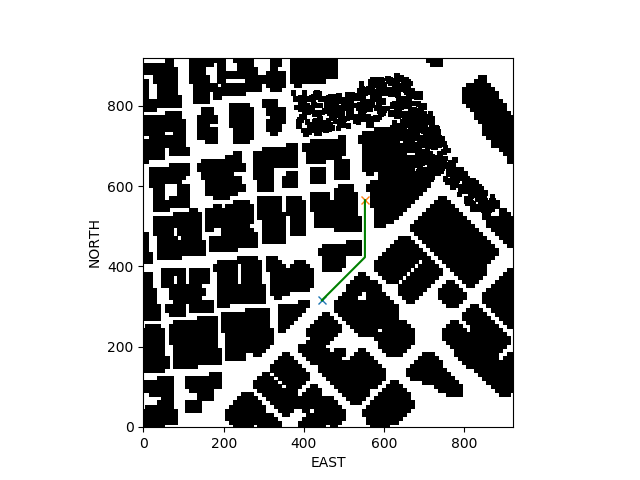
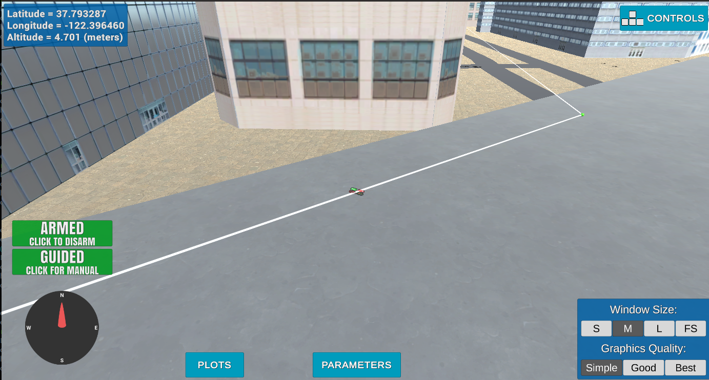

## Project: 3D Motion Planning

---

# Required Steps for a Passing Submission:
1. Load the 2.5D map in the colliders.csv file describing the environment.
2. Discretize the environment into a grid or graph representation.
3. Define the start and goal locations.
4. Perform a search using A* or other search algorithm.
5. Use a collinearity test or ray tracing method (like Bresenham) to remove unnecessary waypoints.
6. Return waypoints in local ECEF coordinates (format for `self.all_waypoints` is [N, E, altitude, heading], where the drone’s start location corresponds to [0, 0, 0, 0].
7. Write it up.
8. Congratulations!  Your Done!

## [Rubric](https://review.udacity.com/#!/rubrics/1534/view) Points
### Here I will consider the rubric points individually and describe how I addressed each point in my implementation.  

---
### Writeup / README

#### 1. Provide a Writeup / README that includes all the rubric points and how you addressed each one.  You can submit your writeup as markdown or pdf.  

You're reading it! Below I describe how I addressed each rubric point and where in my code each point is handled.

### Explain the Starter Code

#### 1. Explain the functionality of what's provided in `motion_planning.py` and `planning_utils.py`
These scripts contain a basic planning implementation that includes a state machine and communication with the simulator in `motion_planning.py`, and an implementation of a* algorithm with some utility functions in `planning_utils.py`.

`motion_planning.py`
- Callbacks from simulator to update position, velocity and state
- general state machine, setting takeoff and landing, and initializing the mission

`planning_utils.py`
- Plot_grid
- Create_grid
- Check valid actions (directions without obstructions)
- A* algorithm with manhatten or euclidean distance heuristic
- Pruning of the  calculated path using a collinearity check

### Implementing Your Path Planning Algorithm

#### 1. Set your global home position

The global home position is set based on the first line in `colliders.csv`. Since the the first line in the csv file contain both variable text and number, it was conventiant to just read the line as a key-value dictionary, splitting the line using comma as separator between variables, and space between the key-value parameters. The home position could then be read from the dictionary, converted into float values.

And here is a lovely picture of our downtown San Francisco environment from above!

#### 2. Set your current local position

The local position is set using a utility function `global_to_local` from Udacity that convert global coordinates into a local frame. It is not described how this is done, but from the code in the git repository it looks like it transforms from geodic to cartiesian UTM coordinates, converted to a local NED frame, with the home position as origin.

Meanwhile, here's a picture of me flying through the trees!

#### 3. Set grid start position from local position
This is another step in adding flexibility to the start location. As long as it works you're good to go!

#### 4. Set grid goal position from geodetic coords
The grid goal position is converted from geodic coordinates into local similarly as the drone position, and then offset to align with the grid center.

#### 5. Modify A* to include diagonal motion (or replace A* altogether)
The A* algorithm is updated with diagonal motions with a cost of sqrt(2), this is implemented in `valid_actions()` and `class Action(Enum)` in `planning_utils.py`. 

#### 6. Cull waypoints 
To remove unnecessary WPs along a straight line, a pruning method using collinearity is implemented, where every point is checked against collinearity using the previous and next point, and is removed if it is located on a linear path between the previous and next point. The code for this step can be found in `planning_utils.py/collinearity_check()` and `prune_path()`. 

### Execute the flight
#### 1. Does it work?
It works! In the plots below it can be seen that the planner finds a path around the corner, and removes points that are located along a linear path. In this example there was only two waypoints, one in the corner, and at the goal. With this we avoid unnecessary breaking at waypoints when flying along a linear path.

Result of the planned path

Image of the drone following the planned path with WPs removed along the straight line.

### Double check that you've met specifications for each of the [rubric](https://review.udacity.com/#!/rubrics/1534/view) points.
  
# Extra Challenges: Real World Planning

For an extra challenge, consider implementing some of the techniques described in the "Real World Planning" lesson. You could try implementing a vehicle model to take dynamic constraints into account, or implement a replanning method to invoke if you get off course or encounter unexpected obstacles.

